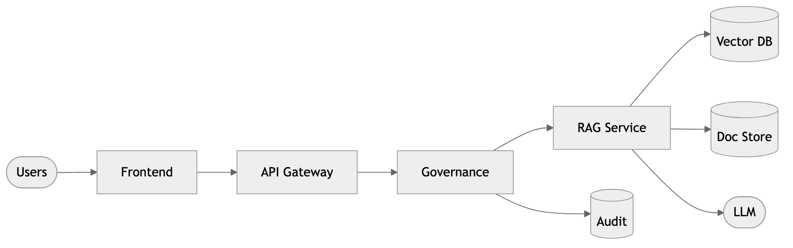

# FDE Reference Architectures



> Reference architecture used across customer deployments.

[](https://github.com/cmangun/fde-reference-architectures/actions/workflows/ci.yml)
[]()
[]()

Reference architectures and engagement playbooks for production AI deployments.

---

## Use in 60 Seconds

```bash
git clone https://github.com/cmangun/fde-reference-architectures.git
cd fde-reference-architectures
cat architectures/01-rag-regulated.md
```

**Copy into your customer repo:**
```bash
cp -r architectures/ /path/to/customer/docs/
```

---

## Customer Value

This pattern typically delivers:
- **2x faster** architecture reviews (pre-validated patterns)
- **Zero compliance gaps** (governance built into diagrams)
- **Consistent delivery** across engagements

---

## Architectures

### 1. RAG in Regulated Environment

```
┌─────────────────────────────────────────────────────────────┐
│                    RAG System (HIPAA/SOC2)                   │
│                                                              │
│  ┌──────────┐    ┌──────────────┐    ┌──────────────────┐   │
│  │  Users   │───▶│  API Gateway │───▶│    RAG Service   │   │
│  └──────────┘    │  (Auth/Rate) │    │  (Retrieval +    │   │
│                  └──────────────┘    │   Generation)    │   │
│                         │            └────────┬─────────┘   │
│                         ▼                     │              │
│                  ┌──────────────┐             │              │
│                  │  Governance  │◀────────────┘              │
│                  │  (PII, Cost) │                            │
│                  └──────────────┘                            │
│                         │                                    │
│         ┌───────────────┼───────────────┐                   │
│         ▼               ▼               ▼                   │
│  ┌───────────┐   ┌───────────┐   ┌───────────┐             │
│  │ Vector DB │   │ Doc Store │   │ Audit Log │             │
│  │ (Pinecone)│   │   (S3)    │   │ (append)  │             │
│  └───────────┘   └───────────┘   └───────────┘             │
└─────────────────────────────────────────────────────────────┘
```

### 2. Agentic Workflow

```
┌─────────────────────────────────────────────────────────────┐
│                 Agentic Workflow System                      │
│                                                              │
│  ┌──────────────────────────────────────────────────────┐   │
│  │                   Orchestrator                        │   │
│  │  ┌────────┐  ┌────────┐  ┌────────┐  ┌────────────┐ │   │
│  │  │ Plan   │─▶│  Act   │─▶│Observe │─▶│  Iterate   │ │   │
│  │  └────────┘  └────────┘  └────────┘  └────────────┘ │   │
│  └──────────────────────────────────────────────────────┘   │
│                          │                                   │
│         ┌────────────────┼────────────────┐                 │
│         ▼                ▼                ▼                 │
│  ┌───────────┐    ┌───────────┐    ┌───────────┐           │
│  │   Tool    │    │   Tool    │    │   Tool    │           │
│  │  Search   │    │  Execute  │    │  Memory   │           │
│  └───────────┘    └───────────┘    └───────────┘           │
└─────────────────────────────────────────────────────────────┘
```

---

## Playbooks

| Playbook | Duration | Artifacts |
|----------|----------|-----------|
| **Discovery** | 1-2 weeks | Stakeholder map, success metrics |
| **Pilot** | 4-6 weeks | MVP, validation criteria |
| **Stabilization** | 2-4 weeks | Runbooks, monitoring, handoff |

---

## How to Use

1. **Copy** the relevant architecture to customer repo
2. **Customize** constraints (data residency, compliance)
3. **Present** to stakeholders in design review
4. **Iterate** based on customer feedback

---

## Next Iterations

- [ ] Add Kubernetes deployment manifests
- [ ] Add Terraform modules
- [ ] Add cost estimation templates
- [ ] Add security review checklist
- [ ] Add incident response playbook

---

## License

MIT © Christopher Mangun

**Portfolio**: [field-deployed-engineer.vercel.app](https://field-deployed-engineer.vercel.app/)
